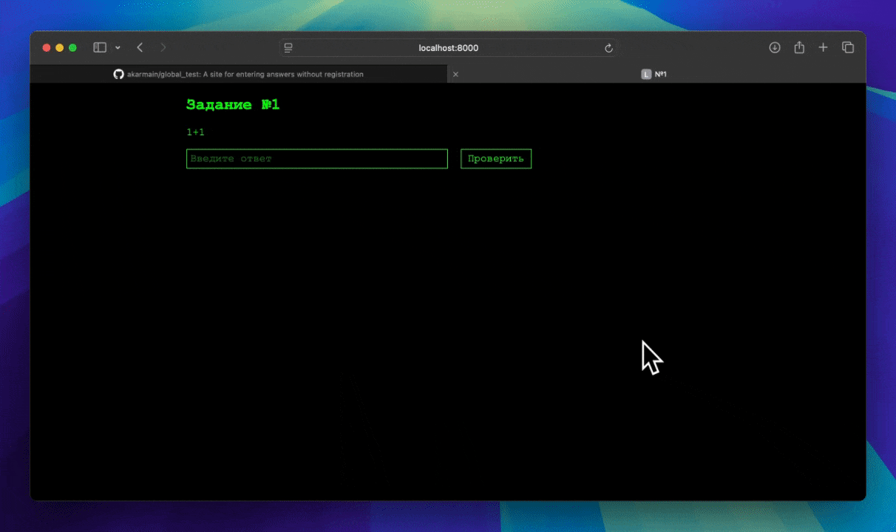

# Global Test



---

### О проекте

Я создал этот проект, чтобы протестировать новую языковую модель ChatGPT-o1 

**Что получилось:**  
Сайт с задачами, которые можно решать через REST API.

---

### Используемый стек технологий

- **Python 3.11+**
- **FastAPI**
- **SQLAlchemy (asyncio)**
- **PostgreSQL**
- **Docker + Docker Compose**

---

### Как запустить проект

#### 1. Склонируйте репозиторий
Выполните команды:
```bash
git clone https://github.com/akarmain/global_test
cd global_test
```

#### 2. Создайте файл .env
Скопируйте файл demo.env в .env:
```bash
cp demo.env .env
```

#### 3. Запустите проект через Docker Compose

1. Соберите и запустите контейнеры:
   ```bash
   docker-compose up --build
   ```

2. После запуска сайт будет доступен по адресу:
   ```
   http://localhost:8000
   ```

---

_Спасибо, что читаете мой код!_
